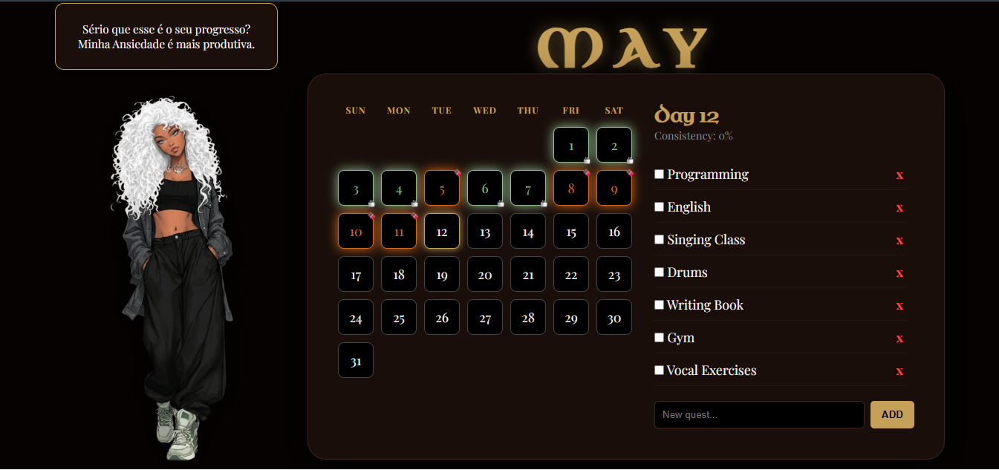

## ⚔️ Elite Habit Tracker — Disciplina ou Deboche

---

> *"A diferença entre um mestre e um fracassado é que o mestre não passou o dia inteiro fingindo produtividade enquanto acumulava tarefa."*

  

---

## 👋 Por que eu criei isso?

Eu desenvolvi esse projeto sozinha porque minha rotina é pesada e eu precisava de uma forma visual, rápida e satisfatória de enxergar tudo o que consegui concluir durante o dia. 🚀

Sabe aquela sensação de terminar um treino intenso e postar um “tá pago”?  
O **Elite Habit Tracker** virou a minha versão digital disso.

Cada tarefa marcada, cada bloco neon aceso e cada checklist completo funciona como uma prova concreta de esforço. Não é só uma lista de hábitos, é um painel visual mostrando que o dia realmente rendeu.

E claro: se é para sobreviver a uma rotina caótica, que seja com estilo.

Por isso misturei:
- estética **Glow/Neon**
- humor ácido
- produtividade
- sarcasmo motivacional
- e um sistema que não passa pano

Ou você entrega resultado e vê o painel brilhando em chocolate 🍫  
Ou recebe o deboche da avatar por deixar tudo acumulado 🍵

---

## 📑 O que o Elite Habit Tracker oferece?

O projeto foi construído com foco em estabilidade, organização e impacto visual.

### 📅 Histórico de Execução
Calendário dinâmico alinhado automaticamente pelos dias da semana (Sun–Sat), permitindo acompanhar padrões de produtividade ao longo do mês.

### 🍵 Motor de Sarcasmo
31 frases ácidas e personalizadas para transformar procrastinação em entretenimento psicológico de qualidade duvidosa.

### ✅ Checklist Blindado
Estrutura com altura fixa e controle de overflow para suportar listas extensas sem destruir o layout.

### ⚡ Visual Elite
Interface escura premium com efeitos neon que transformam produtividade em algo visualmente satisfatório.

---

## 🚀 Acesse o Projeto

  

---

## 🧠 Conhecimentos Aplicados

Desenvolvi o projeto pensando em robustez para suportar rotinas carregadas e grandes volumes de tarefas.

### 🖥️ Manipulação de DOM
Atualização dinâmica de tarefas, progresso e frases sem recarregar a página.

### 📆 Lógica de Calendário (JavaScript)
Cálculo automático do primeiro dia do mês para manter a grade temporal correta.

### 🎨 CSS Avançado
Uso de Flexbox, Grid, controle de overflow e centralização precisa para manter o layout consistente mesmo com muitas tarefas.

### 💾 Persistência de Dados
Uso de LocalStorage para salvar automaticamente o progresso no navegador.

---

## 🛠️ Tecnologias Utilizadas

- HTML5
- CSS3
- JavaScript ES6+
- Google Fonts *(Uncial Antiqua & Playfair Display)*
- Git & GitHub

---

## ✨ Finalização

O Elite Habit Tracker nasceu da necessidade de transformar uma rotina intensa em algo visual, mensurável e até divertido.

Ele pega uma montanha de obrigações e converte em:
- progresso visual
- consistência
- dados
- neon
- e um pouco de deboche psicológico para manter a disciplina viva.

Porque às vezes produtividade não vem da motivação.  
Vem da vergonha de apanhar verbalmente de uma interface neon.

---

## 📩 Contato

📧 **Email:** lailaamorimsant@gmail.com  
🚀 **GitHub:** https://github.com/LailaAmorim  
💼 **LinkedIn:** https://www.linkedin.com/in/laila-amorim-82542a20b

---

  Feito com ❤️ por <strong>Laila Amorim</strong>

